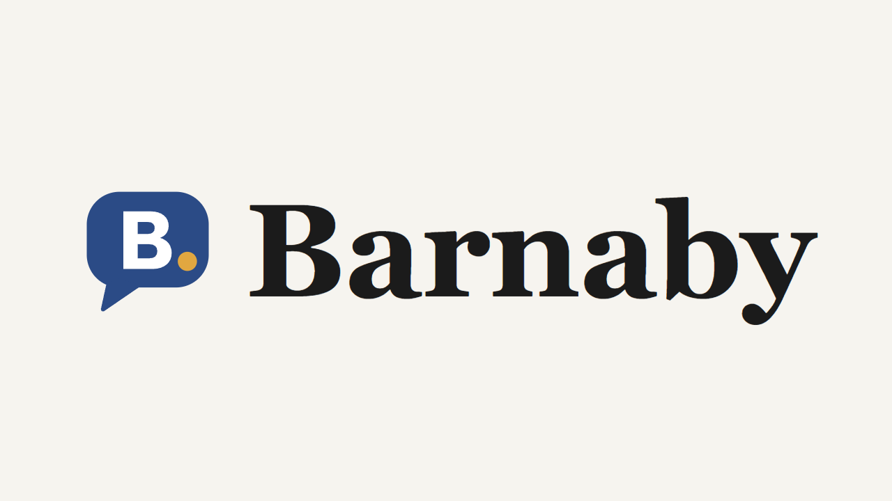
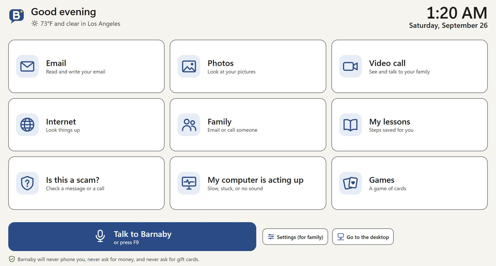
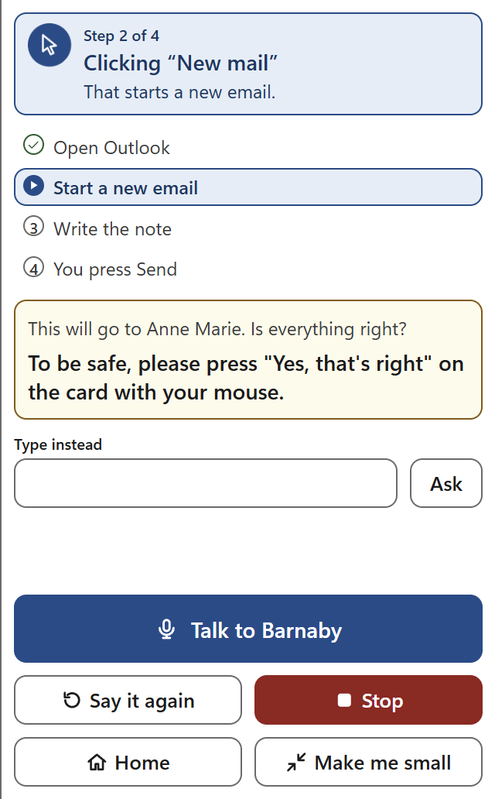
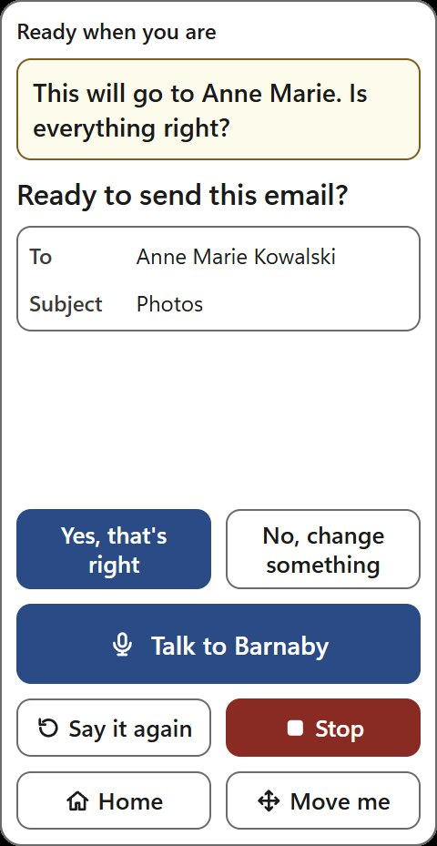
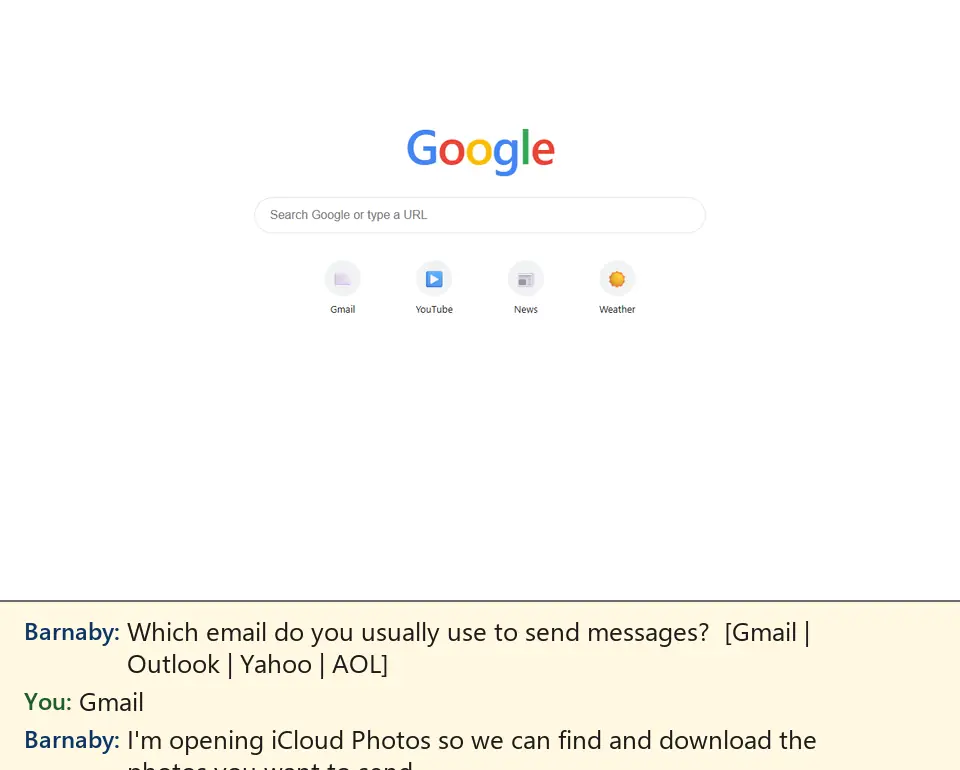

# BarnabyAI



**Help that never hurries.** Barnaby is a patient computer helper for older adults that lives on the Windows PC they already own. You say what you need; Barnaby does the fiddly clicks, explains each step, leaves the personal decisions to you (you pick, you type passwords, you press Yes) and warns you about scams.

Built at Origin Weekend F26 (USC) for Prompt G: AI for the Aging Population.

- **Try it in your browser:** https://try-barnaby.seamengine.workers.dev
- **Install on Windows:** build the installer from `app/` (see below). Setup asks for an OpenRouter API key; no keys are stored in this repository.
- **What's inside:** `app/` (the Electron app and its C# UI Automation helper), `research/` (market, UX, safety, voice and cost research), `website/`, and `SPEC.md` (the architecture).

---

## Screenshots

**The home screen:** big tiles, one big "Talk to Barnaby" button.



**Barnaby at work:** the helper panel says what it is doing right now and shows the plan, step by step.



**You stay in charge:** before anything is sent, you check it and press Yes yourself.



**A real run:** "Email my photos to Anne Marie".



---

# Barnaby — "Help that never hurries."

A voice-first helper that lives on an older adult's Windows PC. It shows a big, calm home screen and a
floating **Help** button that is always on top. You say what you want. Barnaby does it *with* you,
narrating each step and ringing where to click, and saves every finished task as a big-print lesson.
It fixes "my computer is slow" with read-only diagnostics, and guards against scams.

- `research/`: market (01), UX law (02), naming (03), safety (04), tech (05), task playbooks (06)
- `SPEC.md`: architecture plus the binding module contracts
- `app/`: the Electron app (Windows)
- `website/`: the download site (static draft, not deployed)
- `dist/Barnaby-Setup-0.1.0.exe`: the one-click installer (unsigned)
- `sim-runs/`: end-to-end runs of the real agent on a simulated desktop (reports and step screenshots)

## How it works

| Piece | Where | What |
|---|---|---|
| Launcher | `ui/launcher.*` | 9 big tiles, clock and weather, "Talk to Barnaby" (F9), lessons, family |
| Widget | `ui/widget.*`, `ui/voice.js` | "Help" pill, captions, one question at a time, confirm cards, hold-to-talk |
| Overlay | `ui/overlay.*` | yellow and black teaching ring with a label, and the calm full-screen scam card |
| Brain | `src/agent.js`, `src/tools.js` | looks (screenshot + UI Automation list), thinks (OpenRouter `deepseek/deepseek-v4.1-flash`), defaults to "Show me how" (rings each button for the person to click; "Do it for me" is one tap away, and it switches itself when the person gets stuck), never asks permission for routine steps (only big final steps, deletes and anything in a scam episode), asks only what it cannot find out, and explains each step in a short line |
| Guardian | `src/guardian.js`, `src/router.js` | **TypeSafe Jev** (`~typesafe/jev-latest`) routes intents, gates each action (auto / confirm / refuse) and detects scam screens, on top of hard rules that no model can override |
| Scam Shield | `main.js` | watches the window in front; runs Jev only when the keyword prefilter hits |
| Support | `src/support.js` | 9 read-only PowerShell checks and 8 whitelisted fixes, each only after a yes |
| Native | `native/Helper.cs` → `helper.exe` | UI Automation, SendInput, DPI-aware screenshots with password and card fields blacked out, a low-level click watcher, and offline System.Speech. C# 5, built by the Framework csc |
| Voice | `ui/voice.js` + `llm.transcribe` | microphone with voice detection, 16 kHz WAV sent to `google/gemini-3.1-flash-lite` for speech-to-text; MAI-Voice-2 (`src/tts.js`, style "happy") for speech, the Windows voice as fallback; the mic opens by itself after a question; Slower / Normal / Faster buttons |

Promises the code keeps (hard rules):
- The person presses Send, Pay or Delete themselves. The one exception: an email's Send when the request itself said "just send it".
- The person types their own passwords and card numbers.
- Remote-access tools, gift cards, crypto and wires are refused.
- Family alerts need consent and carry only the kind of warning and the time.
- Screenshots are never stored.
- "Delete everything" wipes lessons, memory, the safety diary and logs.

## Run it (dev)

```bash
cd /g/seniorhelper/app
wscript run-dev.vbs
```

This runs without a console window and loads `OPENROUTER_API_KEY` from the central credential store. For the
installed app, a family member enters the key in the setup wizard ("Barnaby connection key").

## Tests
- `node --test test/*.test.js`: unit and integration tests (the live ones are skipped unless `LIVE=1`).
- `LIVE=1 node --test test/live_jev.test.js`: live Jev checks: router 64/64, scam screens 34/34 with no false alarms, gates 52/53.
- `HELPER_MUTE=1 HELPER_USER_DATA=<dir> node_modules/electron/dist/electron.exe . --smoke`: hidden-window smoke test of every window.
- `node_modules/electron/dist/electron.exe test/sim/run-sim.js --scenario anne-marie`: the real agent, LLM and Jev on
  mock Gmail, Outlook and iCloud pages (works while the PC is locked). Scenarios: anne-marie, teach, scam, support, chat,
  scam-click, anydesk-task, outlook-birthday, unsure-email. All pass; about $0.05–0.09 per task.
- `node native/selftest.js`: native helper self-test. **The real-desktop input part (Notepad click and type) still needs
  an unlocked, idle PC.**

## Build the installer
```bash
cd /g/seniorhelper/app
npx electron-builder --win nsis
```
Output: `../dist/Barnaby-Setup-0.1.0.exe`. Copy it to `website/download/`.

## Not built yet (known gaps)
- Accounts, billing and the Free-plan 5-conversation cap described on the website. A consumer build needs a
  key proxy or account system instead of a pasted OpenRouter key.
- Code signing: SmartScreen will warn, and the website explains it.
- Computer use on a second monitor: screenshots and the overlay cover the primary monitor only.
- Elevated windows (UAC prompts, Task Manager): Windows drops injected input there, so Barnaby must point instead.
- A wake word ("Hello, Barnaby"): today it is the Talk button or F9.
- A live test on the real desktop: everything above was verified headless or simulated, because the PC was locked all night.
